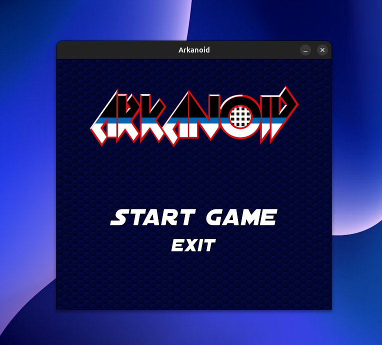
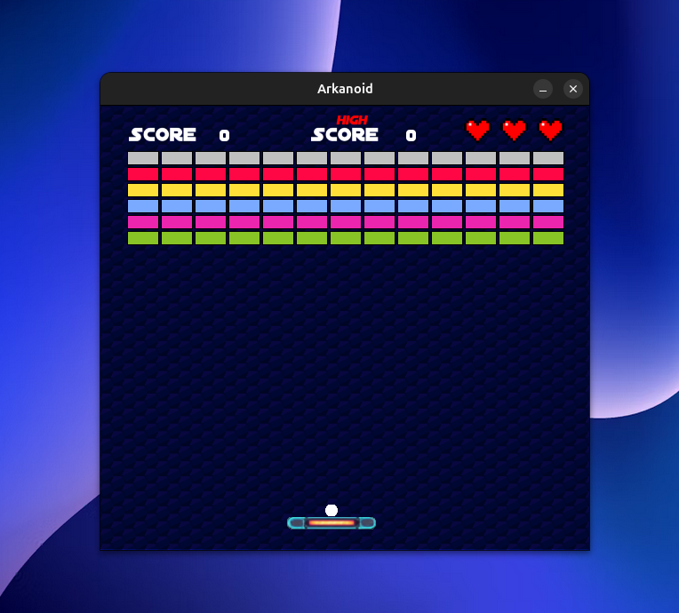
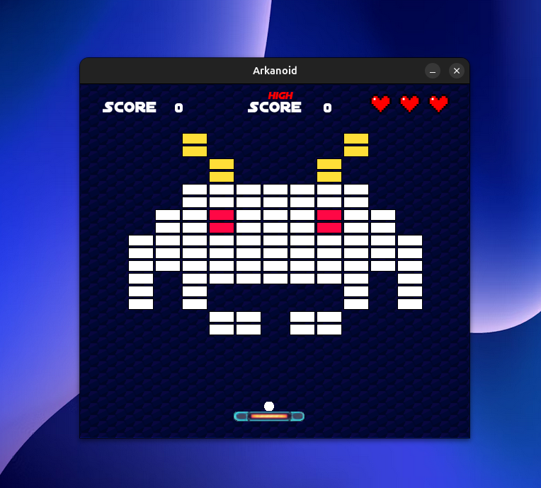
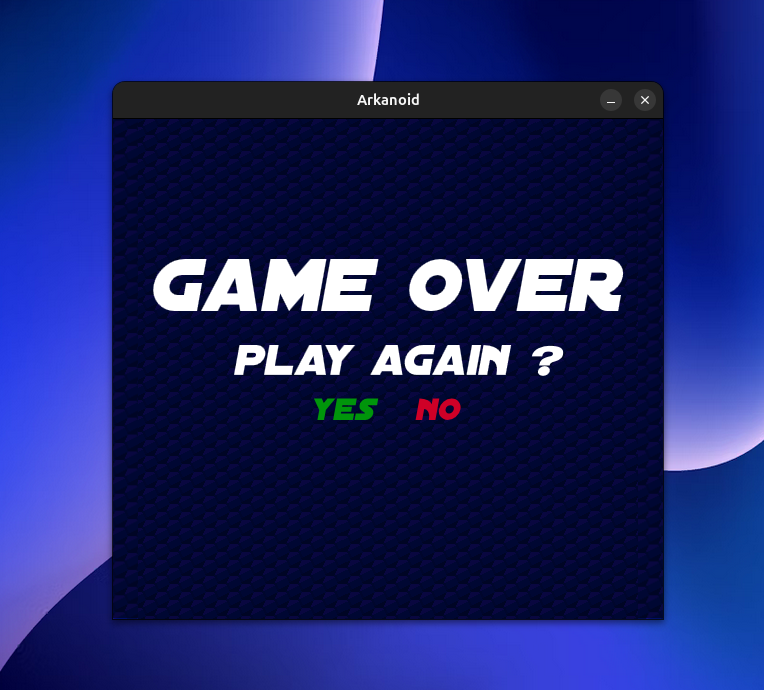
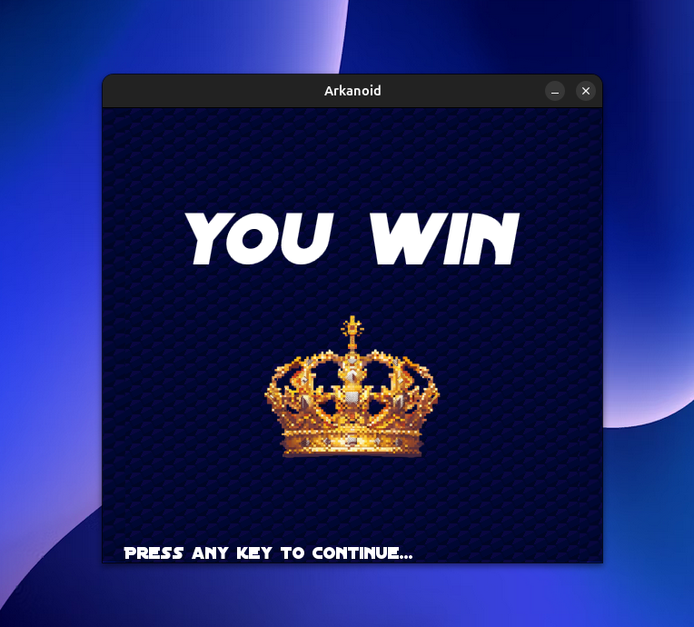
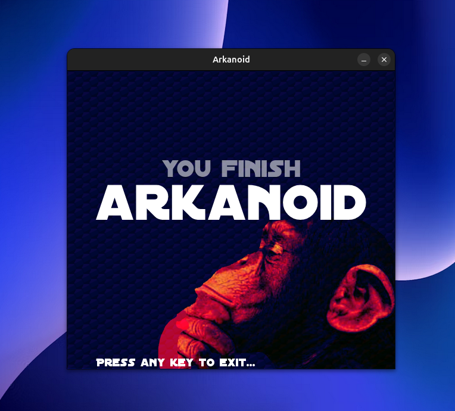

# Arkanoid


---

## 📖 Description

Arkanoid est une réimplémentation moderne du célèbre jeu de casse-briques **Arkanoid**, développée en **C++20** avec la bibliothèque multimédia **Allegro 5**.
Le joueur contrôle une raquette (Spaceship) pour renvoyer une balle et détruire toutes les briques à l’écran.
Le jeu propose plusieurs niveaux, des briques variées, des bonus spéciaux, un système de score et de vies, ainsi que des **effets sonores et musiques d’ambiance**.

---

## 📸 Captures d’écran

| Menu principal                                     | Gameplay                                     | Gameplay 2                                       |
| -------------------------------------------------- | -------------------------------------------- | ------------------------------------------------ |
|  |  |  |

| Restart                                    | Game Over                                         | Victoire                                        |
| ------------------------------------------ | ------------------------------------------------- | ----------------------------------------------- |
|  |  |  |

---

## Sommaire

- [Fonctionnalités principales](#fonctionnalités-principales)
- [Prérequis](#prérequis)
- [Compilation &amp; Installation](#️-compilation--installation)
- [Lancement et exemples d&#39;utilisation](#lancement-et-exemples-dutilisation)
- [Description du Makefile](#description-du-makefile)
- [Organisation du projet](#organisation-du-projet)
- [Auteurs](#auteurs)

---

## ⚡ Fonctionnalités principales

- **Niveaux multiples** : 5 niveaux par défaut (0 à 4), définis en JSON.
- **Briques variées** :
  - Standard (1 coup)
  - Renforcées (2 coups)
  - Indestructibles
- **Bonus spéciaux** :
  - `EXPAND` : agrandir la raquette
  - `CATCH` : attraper la balle
  - `LASER` : tirer des projectiles
  - `SLOW_DOWN` : ralentir la balle
  - `SPLIT` : dupliquer la balle
  - `EXTRA_LIFE` : vie supplémentaire
- **Contrôles intuitifs** :
  - Clavier : ← → / Q D
  - Souris : déplacement horizontal
  - `Espace` : lancer balle
  - `R` : reset
  - `Échap` : quitter
- **Système de vies et score** (high score sauvegardé en JSON).
- **Interface graphique + audio** via **Allegro 5**.

---

## 🛠️ Prérequis

- Compilateur **C++20** (g++ ≥ 10 ou clang++ équivalent).
- **Allegro 5** + modules :
  - allegro_primitives
  - allegro_font
  - allegro_image
  - allegro_ttf
  - allegro_audio
  - allegro_acodec
- **pkg-config**
- **Make** (GNU)
- **json.hpp** (Nlohmann) inclus dans `libs/`.

---

## ⚙️ Compilation & Installation

```bash
git clone https://github.com/9Jawad/Arkanoid.git
cd Arkanoid

# Compilation du jeu
make
```

L’exécutable **Arkanoid** est généré à la racine.
Aucune installation supplémentaire n’est nécessaire.

---

## 🎮 Lancement et exemples d'utilisation

```bash
./Arkanoid
```

### Contrôles

- Déplacement : souris ou clavier (← →, Q/D)
- Lancer balle : `Espace`
- Reset balle + score : `R`
- Quitter : `Échap`

### Gameplay

- Objectif : détruire toutes les briques destructibles.
- Passage automatique au niveau suivant.
- Game Over après perte de toutes les vies.
- Raccourcis : touches `0–8` pour sauter à un niveau.

---

## 📂 Description du Makefile

- **all** (par défaut) → nettoyage + compilation (`pkg-config`).
- **clean** → supprime `obj/` + exécutable.

🔧 Options :

- g++ en **C++20**
- Flags : `-Wall -Wextra -pedantic`
- Includes : `include/`, `libs/`
- Link automatique avec **Allegro**.

---

## 🗂️ Organisation du projet

```text
Arkanoid/
├── assets/                         # Ressources multimédia
│   ├── data/                       # Données de jeu (définition des niveaux, paramètres)
│   │   ├── level_0.json
│   │   ├── level_1.json
│   │   ├── ... (jusqu'à level_8.json)
│   │   └── settings.json
│   ├── fonts/                      # Polices utilisées
│   │   ├── Distant_galaxy.ttf
│   │   └── Pixeled.ttf
│   ├── images/                     # Images (sprites, fonds, UI)
│   │   ├── 1heart.png
│   │   ├── 2heart.png
│   │   ├── 3heart.png
│   │   ├── background.png
│   │   ├── finish.png
│   │   ├── high_score.png
│   │   ├── lose.png
│   │   ├── score.png
│   │   ├── spaceship.png
│   │   ├── start.png
│   │   └── win.png
│   └── sounds/                     # Effets sonores et musiques
│       ├── bip.wav
│       ├── bonus.wav
│       ├── button.wav
│       ├── fall.wav
│       ├── finish.wav
│       ├── lose.wav
│       ├── menu.wav
│       ├── street_Fighter.wav
│       └── win.wav
│
├── docs/                           # Documentation et énoncé du projet
│   └── enonce-project-2024.pdf
│
├── include/                        # Fichiers d'en-tête (architecture MVC + moteur de jeu)
│   ├── controller/                  # Contrôleur du jeu
│   │   └── GameController.hpp
│   ├── core/                        # Structures et entités de base
│   │   ├── Circle.hpp
│   │   ├── Rectangle.hpp
│   │   ├── Vector.hpp
│   │   ├── constants.hpp
│   │   └── utils.hpp
│   ├── engine/                      # Moteur principal
│   │   └── Engine.hpp
│   ├── input/                       # Gestion des entrées utilisateur
│   │   └── InputAction.hpp
│   ├── model/                       # Modèle du jeu (logique, entités)
│   │   ├── Bonus/
│   │   │   ├── Bonus.hpp
│   │   │   ├── Catch.hpp
│   │   │   ├── Expand.hpp
│   │   │   ├── ExtraLife.hpp
│   │   │   ├── Laser.hpp
│   │   │   ├── SlowDown.hpp
│   │   │   └── Split.hpp
│   │   ├── Ball.hpp
│   │   ├── Brick.hpp
│   │   ├── GameModel.hpp
│   │   └── Spaceship.hpp
│   └── view/                        # Vue (interface graphique avec Allegro5)
│       ├── AllegroConfig.hpp
│       ├── AllegroInputAdapter.hpp
│       ├── GameView.hpp
│       ├── UIConfig.hpp
│       └── utils.hpp
│
├── libs/                           # Bibliothèques tierces intégrées
│   └── json.hpp                     # Nlohmann JSON (header-only)
│
├── src/                            # Implémentations C++
│   ├── controller/                  # Contrôleur
│   │   └── GameController.cpp
│   ├── core/                        # Structures de base
│   │   ├── Circle.cpp
│   │   ├── Rectangle.cpp
│   │   └── utils.cpp
│   ├── engine/                      # Moteur du jeu
│   │   └── Engine.cpp
│   ├── model/                       # Logique métier et entités
│   │   ├── Bonus/
│   │   │   ├── Bonus.cpp
│   │   │   ├── Catch.cpp
│   │   │   ├── Expand.cpp
│   │   │   ├── ExtraLife.cpp
│   │   │   ├── Laser.cpp
│   │   │   ├── SlowDown.cpp
│   │   │   └── Split.cpp
│   │   ├── Ball.cpp
│   │   ├── Brick.cpp
│   │   ├── GameModel.cpp
│   │   └── Spaceship.cpp
│   ├── view/                        # Vue (Allegro)
│   │   ├── AllegroConfig.cpp
│   │   ├── AllegroInputAdapter.cpp
│   │   ├── GameView.cpp
│   │   ├── UIConfig.cpp
│   │   └── utils.cpp
│   └── main.cpp                     # Point d’entrée du jeu
│
├── .gitignore
├── LICENSE
├── Makefile                         # Script de compilation
└── README.md

```

---

## 👤 Auteurs

- **Cherkaoui Jawad (576517)**

---

 Projet académique – ULB
